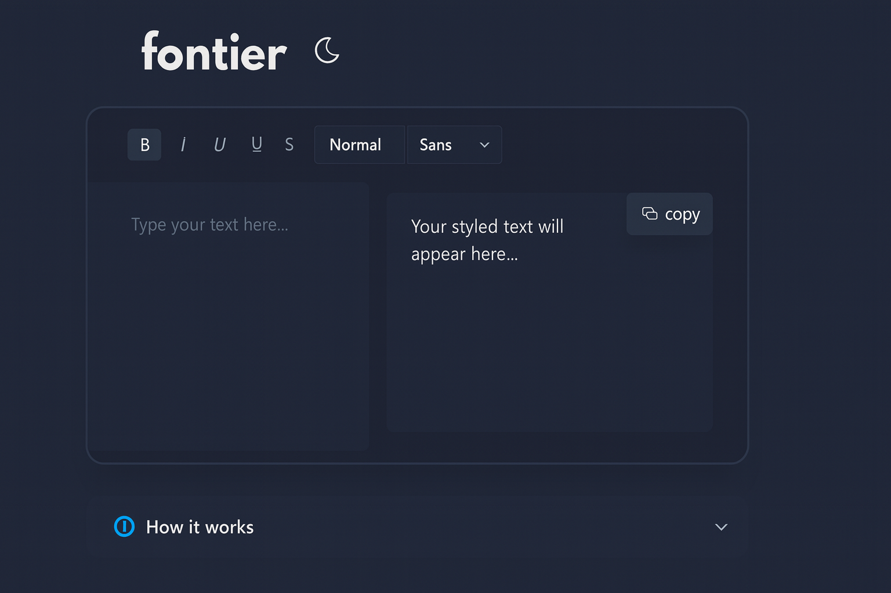
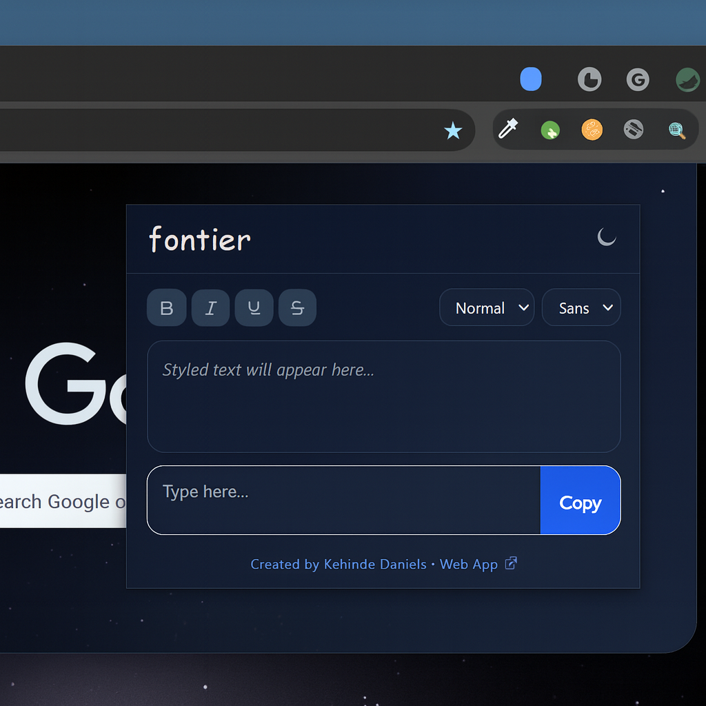
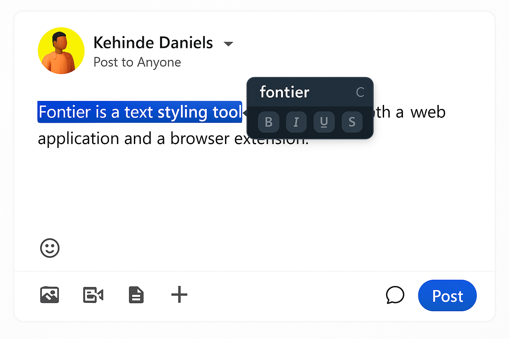

# [Fontier](https://fontier-pied.vercel.app)

Fontier is a text styling tool available as both a **web application** and a **browser extension**.
It allows you to write in **bold, italic, strikethrough, script, and monospace fonts** that survive copy-paste across platforms.

---





## 📌 Problem Statement

Many platforms like **LinkedIn, Twitter, Instagram** do not support rich text formatting.
You cannot make text bold, italic, or styled the way you want.

- If you try bold text in a **LinkedIn post**, LinkedIn strips the formatting.
- Other tools only gives you HTML/CSS, which gets turned into plain text when pasted.

👉 This makes it difficult to emphasize words or create visually engaging posts.

---

## 💡 Solution

Fontier uses **Unicode characters** that mimic styled text:

- Each letter maps to a **Unicode variant** (bold, italic, script, etc.).
- When copied, it’s still plain text — so platforms can’t strip the style.
- Works seamlessly on **LinkedIn, Twitter, Instagram, WhatsApp**, and more.

**In short:** _What you see in Fontier is exactly what you paste anywhere._

---

## ✨ Features

- Convert text into **bold, italic, strikethrough, script, monospace** instantly.
- Copy & paste styled text into social media, messaging apps, and editors.
- Live preview while typing.
- One-click copy.
- **Chrome Extension only:**

  - Popup editor from the toolbar.
  - Floating tray inside editable fields.

- Reverse mode: styled text → plain text.
- Dark & light mode.

---

## 🖼️ Screenshots

### Web App

Full editor with all formatting options.


---

### Chrome Extension – Popup

Style text directly from your browser toolbar.


- **Popup Mode** → Click the Fontier icon in Chrome.
- **Contextual Tray** → Highlight text, a mini toolbar appears, apply styles, then copy or replace in-place.
- **Settings** → Toggle tray behavior, switch themes, manage preferences.

---

### Chrome Extension – Tray

When highlighting text inside a content-editable field (like LinkedIn posts), Fontier shows a floating tray for fast styling.


---

## 🚀 Installation

### Web App

Use directly: [https://fontier-pied.vercel.app](https://fontier-pied.vercel.app)

### Extension (Dev Build)

```bash
git clone https://github.com/KehindeDaniels/Fontier.git
cd Fontier/extension
npm install
npm run build
```

Then:

1. Open Chrome → `chrome://extensions/`
2. Enable **Developer Mode**
3. Click **Load unpacked** → select the `dist/` folder

---

## 📂 Project Structure

```bash
Fontier
├── extension/         # Chrome extension
│   ├── src/
│   │   ├── core/      # Conversion logic (shared)
│   │   ├── content/   # Tray, selection, events, utils
│   │   ├── popup/     # Popup UI
│   │   ├── background # Background worker
│   │   └── ...
│   └── manifest.json
│
├── src/               # Web app (React + Vite)
│   ├── components/    # Toolbar, Editor, Preview
│   ├── core/          # Shared converter, maps, types
│   ├── pages/         # Web pages
│   └── ...
└── legacy/            # Early prototypes
```

---

## 🎯 Usage

### Web App

1. Open [Fontier Web](https://fontier-pied.vercel.app)
2. Type your text
3. Pick a style (bold, italic, etc.)
4. Copy → Paste into LinkedIn, Twitter, WhatsApp, etc.

---

### Extension

- **Popup:** Click the Fontier icon to open a compact editor.
  

- **Tray:** Highlight text → toolbar appears → apply styles → copy or replace in-place.
  

---

## 🛠️ Developer Notes

- **Tech Stack:** React, TypeScript, TailwindCSS, Vite, Manifest v3
- **Core Converter API:**

```ts
convertToUnicode(text: string, format: TextFormat): string
convertFromUnicode(text: string): string
```

### TextFormat

```ts
{
  bold: boolean;
  italic: boolean;
  underline: boolean;
  strikethrough: boolean;
  size: "normal" | "h1" | "h2" | "h3" | "h4";
  font: "normal" | "serif" | "monospace" | "script";
}
```

- Shared `converter.ts` powers both the **web app** and **extension**.
- Modular content scripts: `selection.ts`, `tray.ts`, `events.ts`, `utils.ts`.
- Tray adapts to **system dark mode**.
- Settings (`showTray`) stored in `chrome.storage.sync`.

---

## 🗺 Roadmap

- [ ] More Unicode styles (gothic, cursive, outline).
- [ ] Firefox & Safari extension support.
- [ ] Export styled snippets as images.
- [ ] Mobile PWA optimizations.

---

## 🤝 Contributing

Contributions are welcome!

1. Fork this repo
2. Create a feature branch (`feat/new-style`)
3. Commit (`feat: add gothic style`)
4. Open a PR

---

## 📜 License

MIT © 2025 [Kehinde Daniels](https://github.com/KehindeDaniels)

---
